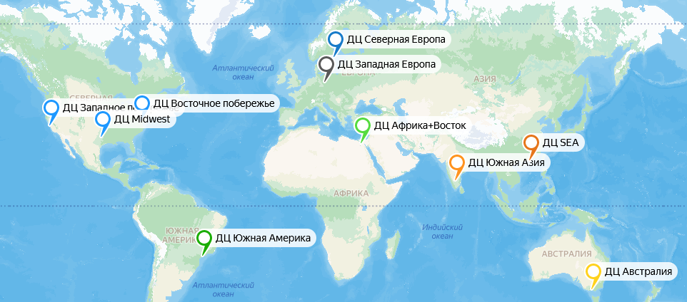
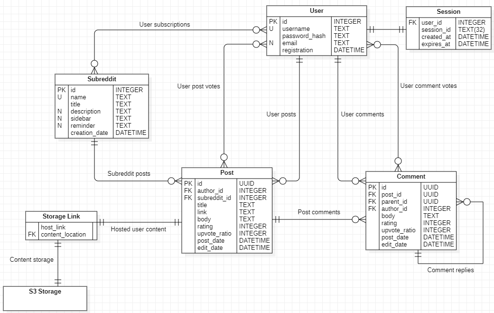
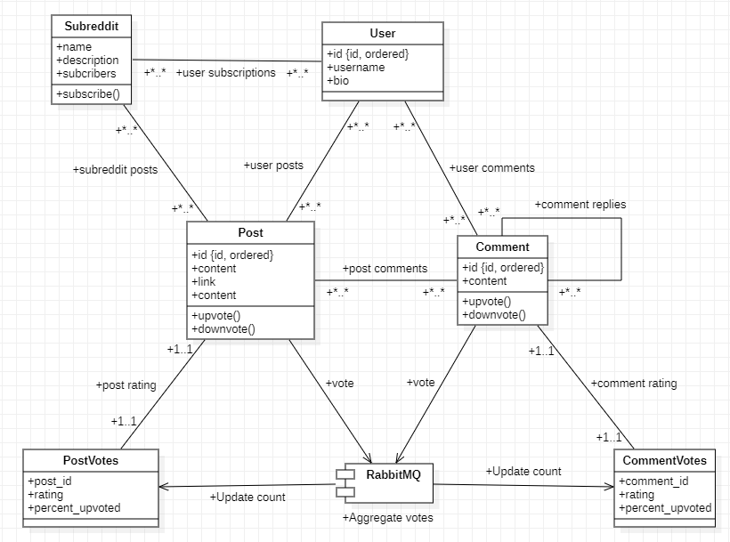
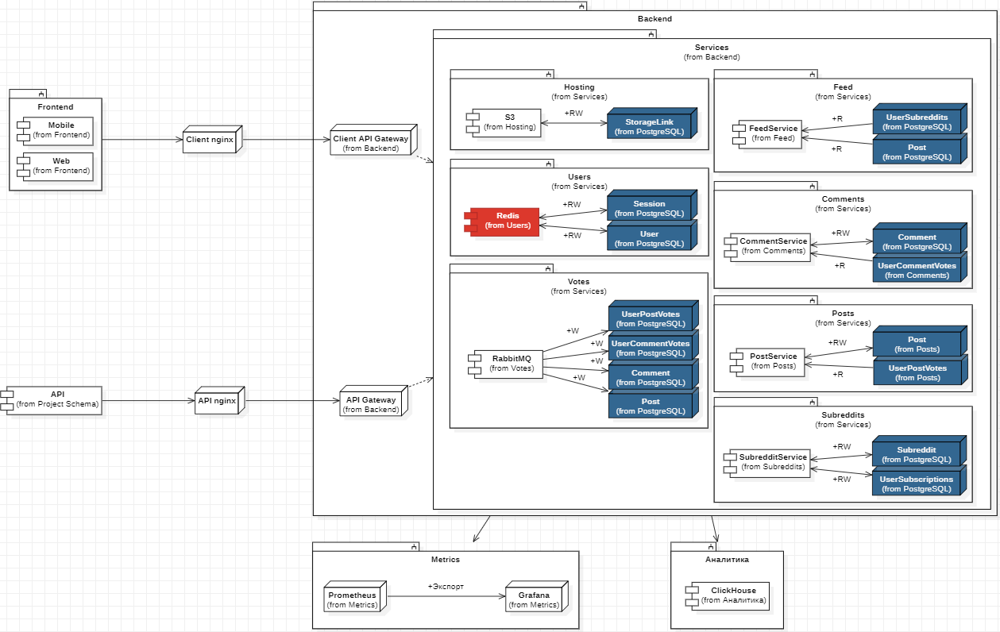

# Оглавление

1. [Тема и целевая аудитория](#1-тема-и-целевая-аудитория)
2. [Расчёт нагрузки](#2-расчёт-нагрузки)
3. [Глобальная балансировка нагрузки](#3-глобальная-балансировка-нагрузки)
4. [Локальная балансировка нагрузки](#4-локальная-балансировка-нагрузки)
5. [Логическая схема БД](#5-логическая-схема-бд)
6. [Физическая схема БД](#6-физическая-схема-бд)
7. [Технологии](#8-технологии)
8. [Схема проекта](#9-схема-проекта)
9. [Обеспечение надёжности](#10-обеспечение-надёжности)
10. [Расчёт ресурсов](#11-расчёт-ресурсов)

# 1. Тема и целевая аудитория

## Тема

Reddit — смесь социальной сети и форума, где пользователи могут делиться текстом, ссылками, и прочим контентом в подфорумах (сабреддитах) с другими пользователями. Сабреддиты создаются и управляются другими пользователями. Пользователи могут голосовать за или против постов других пользователей, комментировать их.

## MVP

1. Регистрация
2. Посты (текстовые, ссылки на другие сайты)
3. Система голосования (+1/-1)
4. Комментарии
5. Сабреддиты (создание, подписка на них)
6. Новостная лента из постов на основе подписок
7. Новостная лента из популярных постов по всему сайту
8. Хостинг пользовательского контента

## ЦА

### Объём трафика

MAU сайта оценивается в [430 миллионов](https://www.usesignhouse.com/blog/reddit-stats#reddit-monthly-active-users) и находится на плато с 2020 года.

### Демографические показатели

Примерно половину трафика составляют [пользователи из США](https://www.similarweb.com/website/reddit.com/#geography). С остальными англоязычными странами этот показатель доходит до 60%.
Основной аудиторией сайта являются [мужчины от 18 до 34 лет](https://www.similarweb.com/website/reddit.com/#demographics) (категории 18-24 и 25-34 примерно равны по величине).

#### Демографическое распределение

Возрастная группа | Процентное соотношение
------------ | -------------
18-24 года | 33.14% 
25-34 года | 33.45% 
35-44 года | 15.88% 
45-54 года | 9.19%
55-64 года | 5.02%
65+ лет | 3.13%

Пол | Процентное соотношение
------------ | -------------
Мужской | 64.48% 
Женский | 35.52% 

Страна | Посещений (млн.)
------------ | -------------
США | 2320
Великобритания | 296
Индия | 280
Канада | 271
Австралия | 192
Германия | 189
Франция | 161
Бразилия | 142
Нидерланды | 138
Швеция | 111

[Источник (2024)](https://worldpopulationreview.com/country-rankings/reddit-users-by-country)

### Статистики пользования сайтом

Средний визит длится [7 минут 46 секунд](https://www.similarweb.com/website/reddit.com/#traffic) и состоит из просмотра 5.81 страниц.

### Ссылки на сайт

На сайт reddit.com существует [2.7 миллиард ссылок c 898737 доменов](https://hypestat.com/info/reddit.com).

### Контент

За [январь-июнь 2023 года](https://www.redditinc.com/policies/2023-h1-transparency-report) на сайте было создано 4.4 миллиарда единиц контента - 277.5 миллионов постов, 1.4 миллиарда комментариев, 473 миллиона личных сообщений и 2.2 миллиарда сообщений в чатах.

# 2. Расчёт нагрузки

## Продуктовые метрики

MAU: 430 миллионов.

DAU: [50 миллионов](https://www.usesignhouse.com/blog/reddit-stats#reddit-daily-active-users).

За 2022 год было сделано [430 миллионов постов](https://www.usesignhouse.com/blog/reddit-stats#how-many-posts-are-on-reddit). Предположив распределение 30/70 между текстовыми и ссылочными постами соответственно, получим 129 миллионов и 301 миллион постов соответственно. 

### Пользователи

За 2023 год DAU (зарегистрированных) вырос на [6.4 миллионов (раздел Reddit Daily Active Users)$^{требуется\ VPN\ для\ пользователей\ из\ РФ}$](https://backlinko.com/reddit-users).

Регистраций в месяц:

* 6.4m аккаунтов/г / 12 ~= **533.33 тысячи аккаунтов в месяц**

### Посты

* Текстовых: 129m постов/г / 12 = **10.75 миллионов постов в месяц**
* Ссылочных: 301m постов/г / 12 ~= **25.08 миллионов постов в месяц**

### Комментарии

За 2022 год было сделано [2.5 миллиардов комментариев](https://www.usesignhouse.com/blog/reddit-stats#how-many-comments-are-on-reddit).

Комментариев в месяц:

* 2.5b комментариев/г / 12 = **208.33 миллиона комментариев в месяц**

### Голоса

За 2022 год было сделано [24 миллиарда голосов](https://www.redditinc.com/blog/reddit-recap-2022-global).

Голосов в месяц:

* 24b голосов/г / 12 = **1 миллиард голосов в месяц**

### Сабреддиты

За 2022 год было создано 2183028 сабреддитов, из которых было забанено 1384911 ([источник - раздел Content Types, Subreddits + Chart 10](https://www.redditinc.com/policies/2022-transparency-report)). Прирост за 2022 год составляет 798117 сабреддитов.

Сабреддитов в месяц:

* 2183028 сабреддитов/г / 12 = 181919 сабреддитов в месяц
    * Из которых забанено 1384911/12 =  115409 сабреддитов в месяц

Общий прирост: **66510 сабреддитов в месяц**.

### Новостная лента

[42.94% посетителей смотрят одну страницу](https://www.similarweb.com/website/reddit.com/#traffic) перед уходом с сайта. 

Основным (~50%) ключевым словом для перехода на сайт является [его название](https://www.similarweb.com/website/reddit.com/#keywords), что приведёт на главную страницу. Также можно предположить, что большинство (например 75%, с запасом основываясь на распределении ключевых слов) оставшихся пользователей (57.06%) - активные пользователей сайта, для которых типичная сессия также начинается с просмотра главной страницы. Остальные визиты - просмотр одного поста, просмотр ленты одного сабреддита, либо сессия, начинающаяся с этих точек.

MAU: [430 миллионов](#1-тема-и-целевая-аудитория).

* 50% от 42.94% смотрят одну страницу: 430m * 0.4294 * 0.5 = 92.321 миллиона посещений от пользователей, которые смотрят только одну страницу
* 75% от 57.06% начинают свой визит с главной страницы: 430m * 0.5706 * 0.75 = 184.018 миллиона посещений от пользователей, которые начинают свою сессию с просмотра новостной ленты

Суммарно происходит **276.339 миллионов просмотров новостной ленты в месяц**.

Основываясь на том, что [49.79% DAU (раздел Reddit Daily Active Users)$^{требуется\ VPN\ для\ пользователей\ из\ РФ}$](https://backlinko.com/reddit-users) состоит из зарегистрированных аккаунтов, можем предположить, что 49.79% показов новостной ленты будет состоять из подписок пользователя (свежие аккаунты имеют несколько подписок на так называемые default subreddits, поэтому лента уже собирается из подписок), а 50.21% - из популярных постов по сайту (раздел Hot из самых популярных постов по safe-for-work сабреддитам).

* Новостная лента из подписок: 276.339m * 0.4979 = **137.589 миллиона показов новостной ленты на основе подписок в месяц**
* Новостная лента по всему сайту: 276.339m * 0.5021 = **138.750 миллионов показов новостной ленты по всему сайту в месяц**

### Хостинг пользовательского контента

Для оценки была открыта [страница популярного контента](https://www.reddit.com/r/popular/), которую будем считать достаточно хорошим отражением распределения контента по сайту, затем подгружены пять страниц.

Из 125 (25 постов/страница * 5 страниц) постов:

* 107 постов являются постами-ссылками
* 81 пост является постом-ссылкой на хостинг Reddit (i.redd.it для изображений, v.redd.it для видео, reddit.com/gallery для альбомов)
* 23 из 81 постов содержали видео

Средняя единица размещаемого контента весит 575970025 байт/148 файлов ~= 3.71 МБ. Для оценки скачивались HD-версии прикреплённых видео, одно из которых весит 254 МБ (267057874 байт), без него средняя единица контента весит 308912151 байт/147 файлов ~= 2 МБ. Такие крупные видео редки, но встречаются, поэтому возьмём за средний объём некоторую величину между 3.71 и 2 МБ, например 2.5 МБ (ниже среднего арифметического значения).

### Расчёт RPS

Секунд в месяце (в среднем): 365\*24\*60\*60/30 = 1051200 c/мес
Секунд в году: 365\*24\*60\*60 = 31536000 c/г

Для оценки RPS по логину возьмём оценку активных сессий в 35% от прироста пользователей. Сессия длится 14 дней. Предположим, что все активные сессии обновляются каждые 14 дней на протяжении всего года, т. е. одна сессия за год обновится 365/14 раз.

* RPS по созданию поста: 430000000 постов/г / 31536000 с/г = 13.63
* RPS по оставлению комментария: 2500000000 комментариев/г / 31536000 с/г = 79.27
* RPS по голосованию: 24000000000 голосов/г / 31536000 с/г = 761.03
* RPS по регистрации: 6400000 пользователей/г / 31536000 с/г = 0.2
* RPS по логину: 0.35 * 6400000 пользователей/г / 31536000 с/г * (365/14) = 1.85
* RPS по созданию сабреддита: 798117 сабреддитов/г / 31536000 с/г = 0.02
* RPS по загрузке одной страницы ленты (подписки): 137589437 показов/мес / 1051200 с/мес = 130.89
* RPS по загрузке одной страницы ленты (общая): 138832965 показов/мес / 1051200 с/мес = 132.07
* RPS по загрузке файла на сервер: 0.757\*0.7\*RPS$_{созд.\ пост} = 7.22

Чтобы оценить запросы на чтение, учтём, что [MAU сайта в 5 раз меньше общего числа визитов](#1-тема-и-целевая-аудитория) (2.2 млрд визитов за последний месяц на 430 MAU). Предположим, что чтение происходит в 3 раза чаще создания контента. Для постов и комментариев в таком случае также подсчитаем метрику чтения.

Запрос                 | RPS    | Пик (x1.5)
---------------------- | ------ | ----------
Создание поста         | 13.63  | 20.44
Чтение поста           | 40.89  | 61.34
Создание комментария   | 79.27  | 118.9
Чтение комментария     | 237.81 | 356.72
Голосование            | 761.03 | 1141.54
Регистрация            | 0.17   | 0.26
Логин                  | 1.85   | 2.78
Создание сабреддита    | 0.02   | 0.03
Показ ленты (подписки) | 130.89 | 196.34
Показ ленты (общая)    | 132.07 | 198.11
Загрузка файла         | 7.22   | 10.83
Чтение файла           | 21.67  | 32.5

### Трафик

Новостная лента состоит из 25 постов на страницу, каждая страница подгружается в индвидуальном порядке при переходе на неё (next 25/previous 25).
В ленте подгружаются только посты, для комментариев нужно перейти по посту.
Одна страница - 25 постов\*0.3\*15120 байт + 25 постов\*0.7\*274 байт = 118195 байт = **115.42 Кбайт**.

Для хостинга пропускная способность будет оцениваться как ежемесячный прирост/секунд в месяце. Потребление контента (стриминг видео и отдачу фото) также оценим в три раза выше, чем хостинг.

* Хостинг (загрузка): (301000000\*0.757)/12\*2.5 МБ / 1051200 c/мес = **45.15 МБ/с**
* Хостинг (отдача): 45.15*3 = **135.45 МБ/c**

Остальной трафик рассчитывается как RPS*сред. вес:

* Пост: (13.63+40.89)\*(0.3\*15120 байт + 0.7\*274 байт) = **251.72 КБ/с**
* Комментарий: (79.27+237.81)\*200 байт = **61.93 КБ/с** 
* Страница ленты: (130.89+132.07)\*115.42 байт = **29.64 МБ/с**
* Сабреддит: 0.02*310.84 байт = **6.22 Б/с**
* Голос: 761.03*161 бит = **14.96 КБ/с**
* Регистрация: 0.17*243.2 байт = **0.04 КБ/с**
* Логин: 1.85*84 байт = **0.15 КБ/с**

Запрос               | Трафик, сред. (КБ/с) | Трафик, пик. (КБ/с)
-------------------- | -------------------- | -------------------
Создание поста       | 62.92                | 94.38
Чтение поста         | 188.79               | 283.19
Создание комментария | 15.48                | 23.22
Чтение комментария   | 46.45                | 69.68
Регистрация          | 0.04                 | 0.06
Логин                | 0.15                 | 0.23
Голос                | 14.95                | 22.44
Сабреддит (общ.)     | 0.01                 | 0.02
Страница ленты       | 30352.11             | 45528.17
Загрузка контента    | 46241.91             | 69362.87
Отдача контента      | 138725.72            | 208088.58

# 3. Глобальная балансировка нагрузки

С помощью [скрипта](https://github.com/bqback/Region-Aggregation) на основе [географических данных о запросах](https://worldpopulationreview.com/country-rankings/reddit-users-by-country) была составлена таблица распределения трафика по регионам и субрегионам мира.

<table>
<thead>
  <tr>
    <th>Регион</th>
    <th>Субрегион</th>
    <th>Пользователи, млн. </th>
    <th>Доля, %</th>
    <th>Пользователи (регион), млн.</th>
    <th>Доля (регион), %</th>
  </tr>
</thead>
<tbody>
  <tr>
    <td rowspan="4">Азия</td>
    <td>Восточная Азия </td>
    <td>204.1</td>
    <td>3.28</td>
    <td rowspan="4">1018.8</td>
    <td rowspan="4">16.4</td>
  </tr>
  <tr>
    <td>Западная Азия</td>
    <td>187.6</td>
    <td>3.02</td>
  </tr>
  <tr>
    <td>Юго-Восточная Азия</td>
    <td>294.4</td>
    <td>4.74</td>
  </tr>
  <tr>
    <td>Южная Азия</td>
    <td>332.7</td>
    <td>5.35</td>
  </tr>
  <tr>
    <td rowspan="3">Америка</td>
    <td>Северная Америка</td>
    <td>2686.8 </td>
    <td>43.24</td>
    <td rowspan="3">2969.7</td>
    <td rowspan="3">47.79</td>
  </tr>
  <tr>
    <td>Центральная Америка</td>
    <td>6.5</td>
    <td>0.1 </td>
  </tr>
  <tr>
    <td>Южная Америка</td>
    <td>276.4</td>
    <td>4.45</td>
  </tr>
  <tr>
    <td rowspan="4">Африка</td>
    <td>Восточная Африка </td>
    <td>13.4</td>
    <td>0.22</td>
    <td rowspan="4">94.5</td>
    <td rowspan="4">1.52</td>
  </tr>
  <tr>
    <td>Западная Африка</td>
    <td>22.7</td>
    <td>0.3</td>
  </tr>
  <tr>
    <td>Северная Африка</td>
    <td>40 </td>
    <td>0.64</td>
  </tr>
  <tr>
    <td>Южная Африка</td>
    <td>18.4</td>
    <td>0.3</td>
  </tr>
  <tr>
    <td rowspan="6">Европа</td>
    <td>Восточная Европа</td>
    <td>97.9</td>
    <td>1.58</td>
    <td rowspan="6">1911.2</td>
    <td rowspan="6">30.76</td>
  </tr>
  <tr>
    <td>Западная Европа</td>
    <td>611.5</td>
    <td>9.84</td>
  </tr>
  <tr>
    <td>Северная Европа </td>
    <td>655.8 </td>
    <td>10.55</td>
  </tr>
  <tr>
    <td>Центральная Европа</td>
    <td>198.6 </td>
    <td>3.2</td>
  </tr>
  <tr>
    <td>Юго-Восточная Европа</td>
    <td>77.3</td>
    <td>1.24</td>
  </tr>
  <tr>
    <td>Южная Европа</td>
    <td>270.1</td>
    <td>4.35</td>
  </tr>
  <tr>
    <td>Океания</td>
    <td>Австралия и Новая Зеландия</td>
    <td>219.7</td>
    <td>3.54</td>
    <td>219.7</td>
    <td>3.54</td>
  </tr>
</tbody>
</table>

RPS по регионам рассчитаем как RPS (общ.) * Доля (регион).

**Азия**
Запрос                 | RPS    | Пик (x1.5)
---------------------- | ------ | ----------
Создание поста         | 2.24   | 3.35
Чтение поста           | 6.71   | 10.06
Создание комментария   | 13.0   | 19.5
Чтение комментария     | 39.0   | 58.5
Голосование            | 124.81 | 187.21
Регистрация            | 0.03   | 0.04
Логин                  | 0.3    | 0.46
Создание сабреддита    | 0.0    | 0.0
Показ ленты (подписки) | 21.47  | 32.2
Показ ленты (общая)    | 21.66  | 32.49
Загрузка файла         | 1.18   | 1.78
Чтение файла           | 3.55   | 5.33

**Америка**
Запрос                 | RPS    | Пик (x1.5)
---------------------- | ------ | ----------
Создание поста         | 6.51   | 9.77
Чтение поста           | 19.54  | 29.31
Создание комментария   | 37.88  | 56.82
Чтение комментария     | 113.65 | 170.48
Голосование            | 363.7  | 545.54
Регистрация            | 0.08   | 0.12
Логин                  | 0.88   | 1.33
Создание сабреддита    | 0.01   | 0.01
Показ ленты (подписки) | 62.55  | 93.83
Показ ленты (общая)    | 63.12  | 94.68
Загрузка файла         | 3.45   | 5.18
Чтение файла           | 10.36  | 15.53

**Африка**
Запрос                 | RPS   | Пик (x1.5)
---------------------- | ----- | ----------
Создание поста         | 0.21  | 0.31
Чтение поста           | 0.62  | 0.93
Создание комментария   | 1.2   | 1.81
Чтение комментария     | 3.61  | 5.42
Голосование            | 11.57 | 17.35
Регистрация            | 0.0   | 0.0
Логин                  | 0.03  | 0.04
Создание сабреддита    | 0.0   | 0.0
Показ ленты (подписки) | 1.99  | 2.98
Показ ленты (общая)    | 2.01  | 3.01
Загрузка файла         | 0.11  | 0.16
Чтение файла           | 0.33  | 0.49

**Европа**
Запрос                 | RPS    | Пик (x1.5)
---------------------- | ------ | ----------
Создание поста         | 4.19   | 6.29
Чтение поста           | 12.58  | 18.87
Создание комментария   | 24.38  | 36.57
Чтение комментария     | 73.15  | 109.73
Голосование            | 234.09 | 351.14
Регистрация            | 0.05   | 0.08
Логин                  | 0.57   | 0.86
Создание сабреддита    | 0.01   | 0.01
Показ ленты (подписки) | 40.26  | 60.39
Показ ленты (общая)    | 40.62  | 60.94
Загрузка файла         | 2.22   | 3.33
Чтение файла           | 6.67   | 10.0

**Океания**
Запрос                 | RPS   | Пик (x1.5)
---------------------- | ----- | ----------
Создание поста         | 0.48  | 0.72
Создание поста         | 0.48  | 0.72
Чтение поста           | 1.45  | 2.17
Создание комментария   | 2.81  | 4.21
Чтение комментария     | 8.42  | 12.63
Голосование            | 26.94 | 40.41
Регистрация            | 0.01  | 0.01
Логин                  | 0.07  | 0.1
Создание сабреддита    | 0.0   | 0.0
Показ ленты (подписки) | 4.63  | 6.95
Показ ленты (общая)    | 4.68  | 7.01
Загрузка файла         | 0.26  | 0.38
Чтение файла           | 0.77  | 1.15

На основе таблицы было принято решение разместить ДЦ в следующих субрегионах:
* Азия: распределение трафика между субрегионами более равномерное, чем между субрегионами Европы. ДЦ будут размещены в Южной Азии и Юго-Восточной Азии. 
* Америка
    * Северная Америка: ввиду огромного преобладания перед остальными субрегионами, здесь будет размещено сразу несколько ДЦ. Все они будут расположены в США, так как основная часть трафика приходит оттуда.
    * Южная Америка: один ДЦ.
* Африка: один ДЦ будет расположен в Африке. Доля трафика достаточно мала, чтобы одного ДЦ хватило на весь регион (с учётом резервного ДЦ). Он будет размещён в Северной Африке, чтобы также частично принять на себя нагрузку Среднего Востока.
* Европа: один ДЦ для Северной Европы и один ДЦ для Западной Европы. Остальные субрегионы Европы приносят значительно меньше трафика, и с резервным ДЦ Западная и Северная Европы должны потянуть нагрузку.
* Океания: отдельный ДЦ для региона обусловлен географической удалённостью от остальных континентов. Поскольку практически весь трафик в регионе приходит из Австралии, ДЦ будет размещён в ней.

Выбор конкретных расположений ДЦ основан на [карте расположения прочих ДЦ](https://www.datacentermap.com/). Сделано предположение, что очаги ДЦ коррелируют с развитием инфраструктуры для связи и ДЦ, например высокие пропускные способности, субсидии на энергообеспечение, низкие и редкие даунтаймы провайдеров, запасные каналы связи.

[Карта](https://yandex.ru/maps/?um=constructor%3A10c762d0d613457116d0bd7f4a747ae5e0da67d3e3af810d2d5f2dc1e2cc71c0&source=constructorLink)

* [Северная Америка](https://www.datacentermap.com/north-america/): три ДЦ будут делить между собой трафик внутри страны, а также трафик из близлежащих стран
    * ДЦ в городе Санта Клара, Калифорния примет на себя западную часть страны. 
    * ДЦ в городе Даллас, Техас примет на себя среднюю часть страны (южные и межзападные штаты), а также вместе с западным ДЦ трафика из северной части Центральной Америки.
    * ДЦ в городе Эшбёрн, Вирджиния примет на себя восточную часть страны, а также трафик из Канады.
* [Южная Америка](https://www.datacentermap.com/south-america/): ДЦ будет расположен в наиболее популярной в субрегионе стране. 
    * ДЦ в городе Сао Пауло (Бразилия) примет на себя трафик субрегиона, а также трафик из южной части Центральной Америки.
* [Африка](https://www.datacentermap.com/datacenters/)
    * ДЦ в городе Каир, Египет примет на себя трафик всего региона, а также часть трафика из Западной Азии (Средний Восток) и Юго-Восточной Европы.
* [Северная Европа](https://www.datacentermap.com/western-europe/): ДЦ примет трафик из Северной Европы, Восточной Европы и части Центральной Европы
    * ДЦ будет расположен в городе Стокгольм, Швеция.
* [Западная Европа](https://www.datacentermap.com/western-europe/): ДЦ примет трафик из Западной Европы, Южной Европы и часть трафика из   Юго-Восточной Европы.
    * ДЦ будет расположен в городе Берлин, Германия.
* [Южная Азия](https://www.datacentermap.com/asia/): ДЦ примет на себя трафик из Южной Азии, часть трафика из Западной Азии.
    * ДЦ будет расположен в городе Бангалор, Индия.
* [Юго-Восточная Азия](https://www.datacentermap.com/asia/): ДЦ примет на себя трафик из Юго-Восточной и Восточной Азии.
    * ДЦ будет расположен в городе Гонконг, Китай.
* [Океания](https://www.datacentermap.com/oceania/)
    * ДЦ будет расположен в городе Мельбурн, Австралия.

Поскольку сервера были выбраны так, чтобы обслуживать субрегион/группу субрегионов, будет применяться latency-based балансировка.

# 4. Локальная балансировка нагрузки

Для балансировки входящих запросов было выбрано L7 балансирование (reverse proxy через nginx). Для балансирования междусервисных запросов было выбрано L3 балансирование (via direct routing).

Отказоустойчивость - на основе таймаутов и попыток.

# 5. Логическая схема БД

В качестве ID для пользователей и сабреддитов будет использоваться serial значение (4 байт), для постов и комментариев будет использоваться UUID - строка из 36 символов (обычно вида `xxxxxxxx-xxxx-xxxx-xxxx-xxxxxxxxxxxx`), имеющая объём 128 бит (16 байт).

Время с датой и часовым поясом занимает 8 байт. Для пользователя это время и дата регистрации, для постов и комментариев это время и дата публикации и время и дата последнего изменения (для нередактированных единиц совпадает с датой публикации).

Поля базы данных хранят текст в кодировке UTF-8, в которой любой символ занимает 2 байта.

Для % апвоутов используется поле smallint, занимающее 2 байта.

## User

Имя пользователя может иметь длину от 3 до 20 символов, и допускает только латинские буквы, цифры, тире (`-`) и подчёркивания (`_`). Предположим, что среднее имя пользователя содержит 9 символов.

Пароли хэшируются алгоритмом Argon2, суммарная длина хэша находится в районе 80 символов, но поскольку хэши со временем могут улучшаться и занимать больше места, оценим длину среднего хэша в 100 символов.

Адрес почты является полностью опциональным, поэтому предположим, что у 30% аккаунтов привязана почта. Средний адрес составляет [21.9 символов](https://atdata.com/blog/long-email-addresses/), округлим это значение до 22.

* `id`: **4 байт**
* `username`: 9 символов в никнейме * 2 = **18 байт**
* `password_hash`: 100 символов в хэше * 2 = **200 байт**
* `email`: 22 символа в адресе почты * 2 = **44 байт**. При усреденении по всем пользователям поле `email` займёт 44*0.3 = **13.2 байт**
* `registration`: **8 байт**

Средняя запись занимает **243.2 байт**, месячный прирост хранилища 6400000/12*243.2 байт = **102.44 МБ**.

## Session

Предположим, что число активных сессий составляет 35% от DAU. Сессия состоит из ID, session ID (32 UTF-8 символа), дат создания и истечения срока годности.

* `user_id`: **4 байт**
* `session_id`: 32 символов в ID сессии * 2 = **64 байт**
* `created_at`: **8 байт**
* `expires_at`: **8 байт**

Средняя запись занимает **84 байт**, месячный прирост хранилища 0.35\*6400000/12\*84 байт = **14.95 МБ**

## Subreddit

В месячном приросте хранилище учтём только итоговый прирост сабреддитов (всего создано - всего забанено).

Имя сабреддита может иметь длину от 3 до 21 символов, и может содержать только латиницу, цифры и подчёркивания (`_`). Предположим, что среднее название состоит из 10 символов.

Название сабреддита может иметь длину до 100 символов. Предположим, что его средняя длина составляет 50 символов. 

Следующие поля опциональны, и, как правило, являются обозначением активно поддерживаемых и развивающихся сообществ. Поскольку таковыми являются далеко не все сабреддиты, предположим, что все эти поля заполнены у сабреддитов, которые имеют хотя бы 50 подписчиков ([28185 в 2022 году](https://reddstats.com/), год выбран для соответствия статистике [общего числа созданных сабреддитов](#сабреддиты)). Такие сабреддиты занимают 28185/798117 * 100% = 3.53% от общего числа созданных в 2022 году.

Описание сабреддита опционально и может содержать до 500 символов. Предположим, что оно содержит 100 символов (чуть меньше 20 слов [среднего предложения на английском языке](https://www.dailywritingtips.com/calculate-your-average-sentence-length/)).

Сайдбар сабреддита опционален и может содержать до 10240 символов. Предположим, что он содержит 1000 символов (более подробное описание, несколько правил, полезные ссылки).

При создании поста в сабреддите может выводиться какой-либо текст-напоминалка, например с кратким содержанием правил. Предположим, что оно содержит 200 символов (пару предложений).

* `id`: **4 байт**
* `name`: 10 символов * 2 = **20 байт**
* `title`: 50 символов * 2 = **100 байт**
* `description`: 100 символов * 2 = **200 байт**. При усреднении по всем сабреддитам поле `description` займёт 200*0.0353 = **7.06 байт**
* `sidebar`: 1000 символов * 2 = **2000 байт**. При усреднении по всем сабреддитам поле `sidebar` займёт 2000*0.0353 = **70.6 байт**
* `reminder`: 200 символов * 2 = **400 байт**. При усреднении по всем сабреддитам поле `reminder` займёт 400*0.0353 = **14.12 байт**

Средняя запись занимает **215.78 байт**, месячный прирост хранилища 798117/12*310.84 байт = **13.69 МБ**

### User subscriptions

Отдельно посчитаем рост хранилища для связующей таблицы в many-to-many связи между User и Subreddit.

Запись "подписчик сабреддита" состоит из пары ID пользователя-ID сабреддита - 4+4 = **8 байт**. Предположим, что для сабреддитов с менее чем 50 подписчиков среднее число подписчиков составляет 5 (сильный пик в меньшем диапазоне аналогично общей тенденции), а для сабреддитов с более чем 50 подписчиков это число составляет 200. Тогда в смежной таблице будет 200\*28185 записей для крупных сабреддитов и 5\*(798117-28185) записей для мелких сабреддитов.

Средняя запись займёт (5\*8\*(798117-28185) + 200\*8\*28185)/798117 = **95.09 байт**, месячный прирост хранилища 798117/12*95.09 = **6.03 МБ**

## Post

Название поста имеет максимальную длину в 300 символов. Возьмём за среднюю длину поста 20% от этого значения - 60 символов (основано на вольной интерпретации [этого](https://www.reddit.com/r/dataisbeautiful/comments/duub8p/average_reddit_submission_score_by_title_length/) графика).

Посты делятся на посты-ссылки (содержат только название и ссылку) и текстовые посты (содержат название и текстовую содержащую).
* Для постов-ссылок примем среднюю длину ссылки за [77 символов](https://stackoverflow.com/a/31758386/7971750).
* Для текстовых постов максимальная длина поста либо 10000 символов, либо 40000 символов (зависит от настроек сабреддита). Предположим, что средняя длина поста - 7500 символов.

* `id`: **16 байт**
* `author_id`: **4 байт**
* `subreddit_id`: **4 байт**
* `title`: 60 символов в среднем названии * 2 = **120 байт**
* `link`: 77 символов в средней ссылке * 2 = **154 байт**. При усреденении по всем постам поле `link` займёт 154*0.7 = **107.8 байт**
* `body`: 7500 символов в среднем посте * 2 - **15000 байт**. При усреднении по всем постам поле `body` займёт 15000*0.3 = **4500 байт**
* `rating`: **4 байт**
* `upvote_ratio`: **2 байт**
* `post_date`: **8 байт**
* `edit_date`: **8 байт**
    
Средняя запись занимает **4773.8 байт**, месячный прирост хранилища 430000000/12\*4773.8 байт = **159.31 ГБ**

## Comment

Максимальная длина комментария - 10000 символов, однако это отметка достигается крайне редко. В среднем, комментарии ограничиваются 100 символами ([1 (2015)](https://www.reddit.com/r/dataisbeautiful/comments/2mmmoe/comment_length_by_subreddit_revised_oc/), [2 (2021)](https://www.reddit.com/r/dataisbeautiful/comments/g469ui/how_the_average_comment_length_compares_between/)).

Предположим, что 50% комментариев являются ответами на другие комментарии. В таком случае поле `parent_id` у них заполнено.

* `id`: **16 байт**
* `post_id`: **16 байт**
* `parent_id`: **16 байт**. При усреденении по всем комментариям поле `parent_id` займёт 16*0.5 = **8 байт**
* `author_id`: **4 байт**
* `body`: 100 символов * 2 = **200 байт**
* `rating`: **4 байт**
* `upvote_ratio`: **2 байт**
* `post_date`: **8 байт**
* `edit_date`: **8 байт**

Средняя запись занимает **266 байт**, месячный прирост хранилища 2500000000/12*266 байт = **51.61 ГБ**

## Votes

Запись голоса состоит из ID пользователя (4 байт), ID контента (16 байт), голоса (1 байт: true - +1, false - -1)

Средняя запись занимает 4\*8+16\*8+1 = **161 бит**, месячный прирост хранилища 24000000000/12*161 бит = **37.49 ГБ**.

## Хостинг (S3 Storage, StorageLink)

Опираясь на пункт [Хостинг пользовательского контента](#хостинг-пользовательского-контента), учтём, что примерно 81/107 ~= 75.7% процентов постов-ссылок являются ссылками на контент, который хостится на серверах сайта. Средняя единица такого контента весит 2.5 МБ.

Месячный прирост хранилища S3 0.757\*301000000/12*2.5 МБ = **45.27 ТБ**

Ссылка на такой контент имеет вид
* `https://` (8 символов)
* один из доменов `i.redd.it`, `v.redd.it`, `reddit.com/gallery` (галереи встречаются реже видео, поэтому предположим, что домен в среднем занимает 10 символов, что чуть меньше среднего арифметического)
* 13 символов названия файла (без расширения), либо 7 символов обозначения галереи (условный ID контента). Предположим, что в среднем ID занимает 11 символов
* В случае изображений в конце ссылки находится расширение файла (например `.png`). Предположим, что в среднем расширение занимает 3 символа (т. к. часть постов его не содержит)

Тогда средняя ссылка займёт 8+10+11+3 = 32 символа.

Предположим, что средний путь до файла в хранилище займёт 125 символов. 

* `host_link`: 32 символа * 2 = **64 байт**
* `content_location`: 125 символов * 2 = **250 байт**

Средняя запись занимает **314 байт**, месячный прирост хранилища 0.757\*301000000/12*314 байт = **5.55 ГБ**

Суммарный месячный прирост хранилища, связанного с хостингом, занимает **45.28 ТБ**.

## Сводная таблица прироста хранилищ

Таблица           | Прирост
----------------- | -------
User              | 102.44 МБ
Session           | 14.95 МБ
Subreddit         | 13.69 МБ
UserSubscriptions | 6.03 МБ
Post              | 159.31 ГБ
Comment           | 51.61 ГБ
Votes             | 37.49 ГБ
Хостинг           | 45.28 ТБ
StorageLink       | 5.55 ГБ
**Итого**         | **45.57 ТБ**

# 6. Физическая схема БД

Шардируем таблицы так, чтобы на один шард приходилось не более 16 ГБ и не более 200 миллионов записей (с небольшим запасам, основываясь на годовых данных из [расчёта нагрузки](#2-расчёт-нагрузки)). Для таблиц с голосами предположено распределение 50/50 между голосами на посты и голосами на записи.

Таблица           | СУБД       | Индекс                                                                                   | Шардинг
----------------- | ---------- | ---------------------------------------------------------------------------------------- | ----------------------------------------------------------
Post              | PostgreSQL | `title` (для быстрого поиска)                                                            | Modulo-based по `id` (равномерное распределение), 10 шардов
Comment           | PostgreSQL | `post_id` (для сбора комментариев к посту), `parent_id` (для сбора веток комментариев)   | Modulo-based по `id` (равномерное распределение), 20 шардов
User              | PostgreSQL | `username` (для поиска и проверки на уникальность)                                       | 
Subreddit         | PostgreSQL | `name` (для быстрого поиска)                                                             | 
UserSubscriptions | PostgreSQL | `user_id` (для составления фида на основе подписок)                                      | 
UserPostVotes     | PostgreSQL | `user_id` (для отображения голосов пользователя при посещении страниц)                   | Modulo-based по `post_id` (равномерное распределение), 75 шардов
UserCommentVotes  | PostgreSQL | `user_id` (для отображения голосов пользователя при посещении страниц)                   | Modulo-based по `post_id` (равномерное распределение), 75 шардов
StorageLink       | PostgreSQL | `host_link` (для быстрой отдачи для поста)                                               | Key-based по `content_location` (по бакетам хранилища), 2 шарда
S3 Storage        | Amazon S3  | [Intelligent-Tiering](https://aws.amazon.com/ru/s3/storage-classes/intelligent-tiering/) | На основе статистики доступа

## Репликация

Таблицы вроде Post, Comment, StorageLink, User которые меняются гораздо реже, чем читаются, будет репликация master-несколько slave для распределения нагрузки.

Таблицы с голосами и подписками будут пользоваться моделью master-master, так как записи происходят часто.

Репликация S3 также проводится как master-slave.

# 8. Технологии

Технология | Область применения                   | Причина
---------- | ------------------------------------ | -------------
PostgreSQL | Основная СУБД                        | Отсутствие лицензирования, полнотекстный поиск при индексировании (для поиска по тексту поста или по имени пользователя, например), поддержка высокой нагрузки при чтении, гибкий оптимизатор запросов (полезен для быстрого составления лент популярных постов, необязательно с просто высшим рейтингом).
RabbitMQ   | Брокерство сообщений для голосования | Поскольку голоса обрабатываются бетчами несколькими эндпоинтами, push-механизм RabbitMQ подходит больше, чем pull-механизм Kafka. Для популярных постов можно воспользоваться возможностью установить приоритет сообщению (RabbitMQ), нет применения для журнала сообщений Kafka, более широкий спектр поддерживаемых языков у RabbitMQ.
Amazon S3  | Хостинг файлов                       | Стандарт индустрии в CDN, intelligent-tiering позволяет держать в приоритете вирусный контент с большим числом хитов, replication для бэкапов и распределением между региональными серверами.
Go         | Backend                              | Современный компилируемый язык с хорошей расширяемостью (обширная стандартная библиотека, импорт пользовательских библиотек осуществляется просто через `import "github.com/path/to/lib/repository`, в библиотеки входят, например, полностью гошная ORM gorm, гибкие фреймворки для веб-приложений типа Gin или Gorilla), простой синтакс, хорошая поддержка конкурентности через горутины и каналы, высокая производительность.
React      | Frontend (приложение)                | Популярный фреймворк для разработки веб-приложений, основанный на компонентах.
Node.js    | Frontend (сервер)                    | Стандарт для фронтенда веб-приложений.
Redis      | Кэш                                  | Более обширный функционал, чем в Memcached, в частности - транзакции, репликации для обеспечения надёжности, снимки состояния, работа с геоданными для регионального распределения трафика.
Nginx      | Проксирование запросов               | Встроенная сдача статики, поддержка HTTP/2, scalability
Clickhouse | Аналитика по СУБД                    | Аналитика для определения популярных тем, закономерностей в подписках для подбора рекомендуемого контента
Prometheus | Экспорт метрик ДЦ                    | Широкоиспользуемый стандарт, есть интеграция с Node, Go, Postgres (через расширения)
Grafana    | Отображение статистики Prometheus    | Широкоиспользуемый стандарт в связке с Prometheus

# 9. Схема проекта

Используется архитектура BFF, заведены отдельные gateway для веб- и мобильных клиентов, и для API для third party взаимодействий (сборщики статистики, инструменты для модерации, сторонние клиенты). Такой подход позволит иметь открытый API для инструментов для сообщества, но при этом контролировать (а для сторонних клиентов возможно и монетизировать) объём поступающих запросов раздельно от основного потока запросов от фронтенда.

# 10. Обеспечение надёжности

Компонент | Технологии 
--------- | ----------
Резервирование | Репликация (БД), резервные сервера и ДЦ 
Сегментирование | Группирование сервисов по постам, комментам, социальной составляющей (subreddit, user) 
Отказоустойчивость | Failover policy (уменьшение запросов на компонент, перезапросы, дублирование источников  метрик, алерты), graceful shutdown
Асинхронный паттерн | Event-sourcing + CQRS
Сихронизация | saga (хореография)
Observability | Логгирование (структурированные, традиционные уровни логгирования с переключаемым debug-режимом), мониторинг (frontend - real-time, БД и backend - synthetic, API - external), Prometheus+Grafana, AlertBot

## Резервирование

Резервные ДЦ - по одному дубликату хранилища и БД на [каждый выбранный ДЦ](#3-глобальная-балансировка-нагрузки) в близлежащих городах. Основной функционал сервиса легковесен и в целом достаточно иметь по 2 юнита на ДЦ, дублирующих логику.

Реплика БД - на основе CQRS.

# 11. Расчёт ресурсов 

На основе расчитанных RPS и представлении о сервисах почти вся логика основана на JSON API. Региональные ДЦ будут делить между собой нагрузку, пропорции будут основаны на [этой](https://worldpopulationreview.com/country-rankings/reddit-users-by-country) карте. RPS и потребление трафика будут основаны на пиковой нагрузке (x1.5) для повышения отказоустойчивости.

Лёгкие таблицы (пользователи, сабреддиты) можно хранить в RAM.

## Общий расчёт

Сервис     | RPS     | Пропускная способность | Хранилище (в мес.) | Сложность
---------- | ------- | ---------------------- | ------------------ | ---------------------
Posts      | 81.78   | 377.66 КБ/c            | 158.31 ГБ          | Лёгкое JSON API
Users      | 0.26    | 0.3 КБ/с               | 0.12 ГБ            | Лёгкое JSON API
Comments   | 475.62  | 92.9 КБ/с              | 51.61 ГБ           | Лёгкое JSON API
Votes      | 1141.54 | 22.44 КБ/с             | 37.49 ГБ           | Лёгкое JSON API
Subreddits | 0.03    | 0.02 КБ/с              | 0.02 ГБ            | Лёгкое JSON API
Feed       | 394.45  | 44.46 МБ/с             | -                  | Средняя бизнес-логика
Hosting    | 43.33   | 270.95 МБ/с            | 45.28 ТБ           | Тяжёлая бизнес-логика
PostgreSQL | 2150    | 50 МБ/с                | 250 ГБ             | --

Закладываемое хранилище посчитаем на 5 лет.

Сервис     | RPS     | CPU (ядер) | RAM      | Net        | Storage 
---------- | ------- | ---------- | -------- | ---------- | --------
Posts      | 81.78   | 2          | 1 ГБ     | 1 МБ/с     | --- 
Users      | 0.26    | 2          | 8 ГБ     | 1 МБ/с     | --- 
Comments   | 475.62  | 2          | 2 ГБ     | 1 МБ/c     | --- 
Votes      | 1141.54 | 4          | 2 ГБ     | 1 МБ/c     | --- 
Subreddits | 0.03    | 2          | 8 ГБ     | 1 МБ/c     | --- 
Feed       | 394.45  | 8          | 2 ГБ     | 45 МБ/с    | ---
Hosting    | 43.33   | 16         | -------- | 300 МБ/с   | 2.65 ПБ
PostgreSQL | 2150    | 16         | 14.65 ТБ | 50 МБ/с    | 14.65 ТБ

На основе [глобальной балансировки](#3-глобальная-балансировка-нагрузки) определим долю трафика на выбранные ДЦ. Для случаев, когда ДЦ делят трафик какого-то субрегиона между собой, доля делится поровну.

<table>
<thead>
  <tr>
    <th>Субрегион</th>
    <th>Доля, %</th>
    <th>Датацентр </th>
    <th>Доля датацентра, %</th>
  </tr>
</thead>
<tbody>
  <tr>
    <td rowspan="3">Северная Америка </td>
    <td rowspan="3">43.24</td>
    <td>Западное побережье</td>
    <td>14.41</td>
  </tr>
  <tr>
    <td>Восточное побережье</td>
    <td>14.41</td>
  </tr>
  <tr>
    <td rowspan="2">Midwest </td>
    <td rowspan="2">14.46</td>
  </tr>
  <tr>
    <td rowspan="2">Центральная Америка</td>
    <td rowspan="2">0.1</td>
  </tr>
  <tr>
    <td rowspan="2">Южная Америка</td>
    <td rowspan="2">4.5</td>
  </tr>
  <tr>
    <td>Южная Америка</td>
    <td>4.45</td>
  </tr>
  <tr>
    <td>Северная Европа</td>
    <td>10.55</td>
    <td rowspan="3">Северная Европа </td>
    <td rowspan="3">13.73</td>
  </tr>
  <tr>
    <td>Восточная Европа</td>
    <td>1.58</td>
  </tr>
  <tr>
    <td rowspan="2">Центральная Европа</td>
    <td rowspan="2">3.2</td>
  </tr>
  <tr>
    <td rowspan="4">Западная Европа</td>
    <td rowspan="4">16.41</td>
  </tr>
  <tr>
    <td>Западная Европа</td>
    <td>9.84</td>
  </tr>
  <tr>
    <td>Южная Европа</td>
    <td>4.35</td>
  </tr>
  <tr>
    <td rowspan="2">Юго-Восточная Европа</td>
    <td rowspan="2">1.24 </td>
  </tr>
  <tr>
    <td rowspan="3">Африка+Восток </td>
    <td rowspan="3">3.65</td>
  </tr>
  <tr>
    <td>Африка </td>
    <td>1.52</td>
  </tr>
  <tr>
    <td rowspan="2">Западная Азия </td>
    <td rowspan="2">3.02</td>
  </tr>
  <tr>
    <td rowspan="2">Южная Азия</td>
    <td rowspan="2">6.86</td>
  </tr>
  <tr>
    <td>Южная Азия</td>
    <td>5.35</td>
  </tr>
  <tr>
    <td>Юго-Восточная Азия</td>
    <td>4.74</td>
    <td rowspan="2">SEA</td>
    <td rowspan="2">8.02</td>
  </tr>
  <tr>
    <td>Восточная Азия</td>
    <td>3.28</td>
  </tr>
  <tr>
    <td>Океания</td>
    <td>3.54</td>
    <td>Австралия </td>
    <td>3.54</td>
  </tr>
</tbody>
</table>

