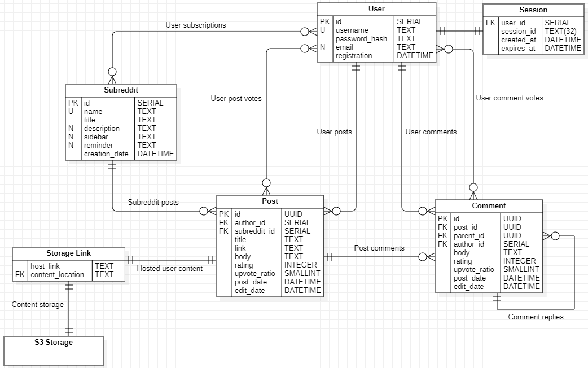

# 1. Тема и целевая аудитория

## Тема

Reddit — смесь социальной сети и форума, где пользователи могут делиться текстом, ссылками, и прочим контентом в подфорумах (сабреддитах) с другими пользователями. Сабреддиты создаются и управляются другими пользователями. Пользователи могут голосовать за или против постов других пользователей, комментировать их.

## MVP

1. Регистрация
2. Посты (текстовые, ссылки на другие сайты)
3. Система голосования (+1/-1)
4. Комментарии
5. Сабреддиты (создание, подписка на них)
6. Новостная лента из постов на основе подписок
7. Новостная лента из популярных постов по всему сайту
8. Хостинг пользовательского контента

## ЦА

### Объём трафика

MAU сайта оценивается в [430 миллионов](https://www.usesignhouse.com/blog/reddit-stats#reddit-monthly-active-users) и находится на плато с 2020 года.

### Демографические показатели

Примерно половину трафика составляют [пользователи из США](https://www.similarweb.com/website/reddit.com/#geography). С остальными англоязычными странами этот показатель доходит до 60%.
Основной аудиторией сайта являются [мужчины от 18 до 34 лет](https://www.similarweb.com/website/reddit.com/#demographics) (категории 18-24 и 25-34 примерно равны по величине).

#### Демографическое распределение

Возрастная группа | Процентное соотношение
------------ | -------------
18-24 года | 33.14% 
25-34 года | 33.45% 
35-44 года | 15.88% 
45-54 года | 9.19%
55-64 года | 5.02%
65+ лет | 3.13%

Пол | Процентное соотношение
------------ | -------------
Мужской | 64.48% 
Женский | 35.52% 

Страна | Посещений (млн.)
------------ | -------------
США | 2320
Великобритания | 296
India | 280
Канада | 271
Австралия | 192
Германия | 189
Франция | 161
Бразилия | 142
Нидерланды | 138
Швеция | 111

[Источник (2024)](https://worldpopulationreview.com/country-rankings/reddit-users-by-country)

### Статистики пользования сайтом

Средний визит длится [7 минут 46 секунд](https://www.similarweb.com/website/reddit.com/#traffic) и состоит из просмотра 5.81 страниц.

### Ссылки на сайт

На сайт reddit.com существует [2.7 миллиард ссылок c 898737 доменов](https://hypestat.com/info/reddit.com).

### Контент

За [январь-июнь 2023 года](https://www.redditinc.com/policies/2023-h1-transparency-report) на сайте было создано 4.4 миллиарда единиц контента - 277.5 миллионов постов, 1.4 миллиарда комментариев, 473 миллиона личных сообщений и 2.2 миллиарда сообщений в чатах.

# 2. Расчёт нагрузки

## Продуктовые метрики

MAU: 430 миллионов.

DAU: [50 миллионов](https://www.usesignhouse.com/blog/reddit-stats#reddit-daily-active-users).

За 2022 год было сделано [430 миллионов постов](https://www.usesignhouse.com/blog/reddit-stats#how-many-posts-are-on-reddit). Предположив распределение 30/70 между текстовыми и ссылочными постами соответственно, получим 129 миллионов и 301 миллион постов соответственно. 

### Посты:

* Текстовых: 129m постов/г / 12 = 10.75 миллионов постов в месяц
* Ссылочных: 301m постов/г / 12 ~= 25.08 миллионов постов в месяц

### Комментарии

За 2022 год было сделано [2.5 миллиардов комментариев](https://www.usesignhouse.com/blog/reddit-stats#how-many-comments-are-on-reddit).

Комментариев в месяц:

* 2.5b комментариев/г / 12 = 208.33 миллиона комментариев в месяц

### Голоса

За 2022 год было сделано [24 миллиарда голосов](https://www.redditinc.com/blog/reddit-recap-2022-global).

Голосов в месяц:

* 24b голосов/г / 12 = 1 миллиард голосов в месяц

### Сабреддиты

За 2022 год было создано 2183028 сабреддитов, из которых было забанено 1384911 ([источник - раздел Content Types, Subreddits + Chart 10](https://www.redditinc.com/policies/2022-transparency-report)).

Сабреддитов в месяц:

* 2183028 сабреддитов/г / 12 = 181919 сабреддитов в месяц
    * Из которых забанено 1384911/12 =  115409 сабреддитов в месяц

### Среднее хранилище

#### Посты

Название поста имеет максимальную длину в 300 символов. Возьмём за среднюю длину поста 20% от этого значения - 60 символов (основано на вольной интерпретации [этого](https://www.reddit.com/r/dataisbeautiful/comments/duub8p/average_reddit_submission_score_by_title_length/) графика).

* Один UTF-8 символ названия = 2 байта, среднее название 2*60 = **120 байт**.

Посты делятся на посты-ссылки (содержат только название и ссылку) и текстовые посты (содержат название и текстовую содержащую).
* Для постов-ссылок примем среднюю длину ссылки за [77 символов](https://stackoverflow.com/a/31758386/7971750).
* Для текстовых постов максимальная длина поста либо 10000 символов, либо 40000 символов (зависит от настроек сабреддита). Предположим, что средняя длина поста - 7500 символов.

* 77 символов в средней ссылке: 2*77 = **154 байта**. Средний пост-ссылка весит **274 байта**.
    * Текстовые посты за месяц займут 129000000/12*15120 байт = **162 Гбайт**
* 7500 символов в среднем текстовом посте: 2*7500 = **15000 байт** = **15 Кбайт**. Средний текстовый пост весит **15.12 Кбайт**.
    * Ссылочные посты за месяц займут 301000000/12*274 байт ~= **6.87 Гбайт**

Суммарно посты за месяц займут **168.87 Гбайт**.

#### Комментарии

Максимальная длина комментария - 10000 символов, однако это отметка достигается крайне редко. В среднем, комментарии ограничиваются 100 символами ([1 (2015)](https://www.reddit.com/r/dataisbeautiful/comments/2mmmoe/comment_length_by_subreddit_revised_oc/), [2 (2021)](https://www.reddit.com/r/dataisbeautiful/comments/g469ui/how_the_average_comment_length_compares_between/)).

* Средний комментарий занимает 2*100 = **200 байт**.

Суммарно комментарии за месяц займут 2500000000/12*200 байт ~= **4.17 Гбайт**.

#### Голоса

Голоса обрабатываются [пачками (vote processing в инфраструктуре reddit.com по ссылке)](https://www.redditstatus.com/). Предположим, что отдельно хранятся
* Количество голосов у единицы контента (пост или комментарий) - значение int, 4 байта.
* Голоса отдельно взятого пользователя - хэш/id единицы контента (128 бит = 16 байт) и голос (true = +1, false = -1, 1 бит).

* Суммарно голос занимает 4+128+1 = **133 байта**.

Суммарно голоса за месяц займут 24000000000/12*233 байт = **133 Гбайт**.

## Технические метрики 

Метрика (в месяц) | Количество (млн) | Хранилище (Гбайт)
------------ | ------------- | -------------
Посты | 10.75 | 168.87 
Комментарии | 208.33 | 4.17
Голоса | 1000 | 133

### Расчёт RPS

Секунд в году: 365\*24\*60\*60 = 31536000 c/г

* RPS по созданию поста: 430000000 постов/г / 31536000 с/г = 13.63
* RPS по оставлению комментария: 2500000000 комментариев/г / 31536000 с/г = 79.27
* RPS по голосованию: 24000000000 голосов/г / 31536000 с/г = 761.03

Запрос | RPS
------------ | -------------
Создание поста | 13.63
Создание комментария | 79.27 
Голосование | 761.03

### Трафик

Новостная лента состоит из 25 постов на страницу, каждая страница подгружается в индвидуальном порядке при переходе на неё (next 25/previous 25).

В ленте подгружаются только посты, для комментариев нужно перейти по посту.

Одна страница - 25 постов\*0.3\*15120 байт + 25 постов\*0.7\*274 байт = 118195 байт = **118.2 Кбайт**.

Остальной трафик рассчитывается как RPS*сред. вес:

* Пост: 13.63 \* (0.3\*15120 + 0.7\*274) = **64439.91 байт/с**
* Комментарий: 79.27\*200 = **15974 байт/с** 

Запрос | Трафик, сред. (Кбайт/с)
------------ | -------------
Создание поста | 64.44
Создание комментария | 15.97

# 3. Глобальная балансировка нагрузки

* Поскольку более 50% трафика приходится на Северную Америку, два датацентра будут расположены на западном (Санта Клара, Калифорния) и восточном (Эшбёрн, Вирджиния) побережьях, а также в Далласе, Техас для средней части страны.
    * Дополнительные датацентры будут находиться в Канаде (Торонто), Австралии (Мельбурн), Великобритании (Лондон), Индии (Бангалор). Датацентры для Западной Европы будут размещены в Берлине (Германия), для Северной - в Швеции (Стокгольм). Датацентр для Южной Америке будет расположен в Сао Пауло (Бразилия).

* Для датацентров выбраны очаги урбанизации, на которые придётся основная доля трафика. ДЦ в США также полагаются на развитую инфраструктуру этих городов - выбранные города располагают у себя наибольшее число ДЦ в соответствующем штате, три выбранных штата - [наибольшее число ДЦ относительно остальной страны](https://www.datacentermap.com/usa/).

* Общая нагрузка баланисроваться на основании удалённости (latency-based).

* Нагрузка внутри региона будет балансироваться с помощью BGP Anycast.

# 4. Локальная балансировка нагрузки

Для балансировки входящих запросов было выбрано L7 балансирование (reverse proxy через nginx). Для балансирования междусервисных запросов было выбрано L3 балансирование (via direct routing).

Поскольку на голоса приходится основная доля запросов, запросы будут обрабатываться пачками через RabbitMQ.

Отказоустойчивость - на основе таймаутов и попыток.

# 5. Логическая схема БД

# 6. Физическая схема БД

Таблица | СУБД | Индекс | Шардинг
------------ | ------------- | ------------- | -------------
Post | PostgreSQL | `id`, `title`, `author_id` | Range-based (на PostVotes)
User | PostgreSQL | `username`
Subreddit | PostgreSQL | `name`
Comment | PostgreSQL | `author_id`, `parent_id` (в промежуточной `*..*` таблице) | Range-based (на CommentVotes)
PostVotes | PostgreSQL, аггрегация через RabbitMQ | `post_id`
CommentVotes | PostgreSQL, аггрегация через RabbitMQ | `comment_id`

# 7. Технологии

Технология | Область применения | Причина
------------ | ------------- | -------------
PostgreSQL | Основная СУБД | Отсутствие лицензирования, полнотекстный поиск при индексировании (для поиска по тексту поста или по имени пользователя, например), поддержка высокой нагрузки при чтении, гибкий оптимизатор запросов (полезен для быстрого составления лент популярных постов, необязательно с просто высшим рейтингом).
RabbitMQ | Брокерство сообщений для голосования | Поскольку голоса обрабатываются бетчами несколькими эндпоинтами, push-механизм RabbitMQ подходит больше, чем pull-механизм Kafka. Для популярных постов можно воспользоваться возможностью установить приоритет сообщению (RabbitMQ), нет применения для журнала сообщений Kafka, более широкий спектр поддерживаемых языков у RabbitMQ.
